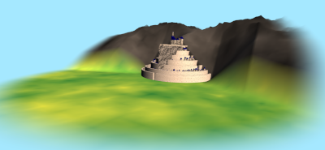
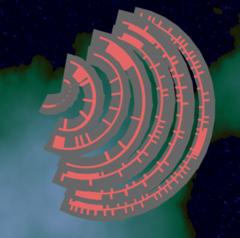
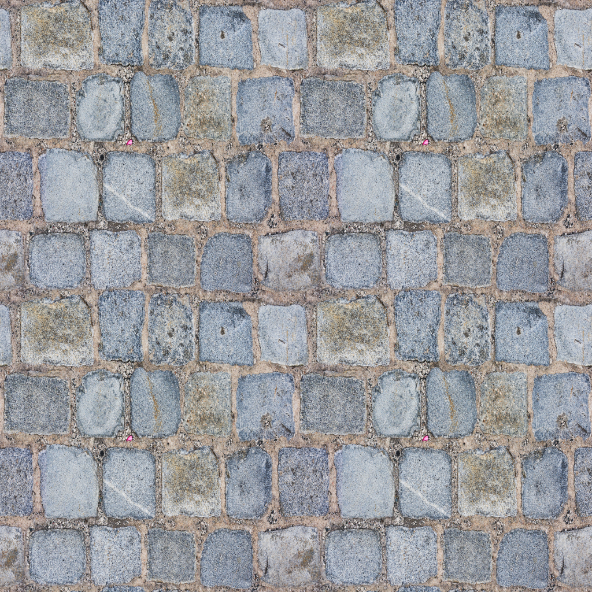
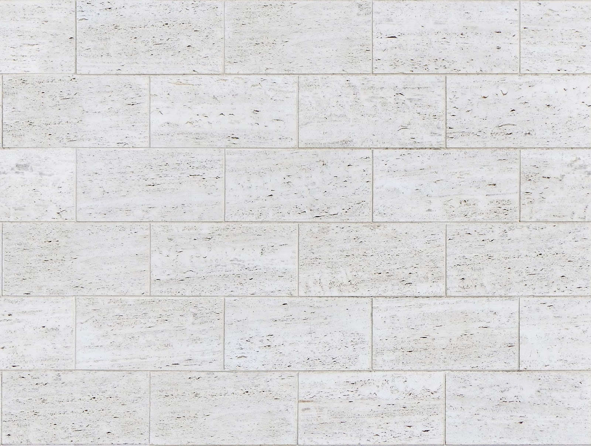
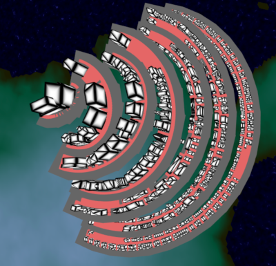
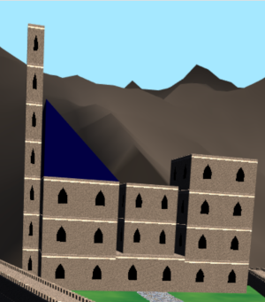
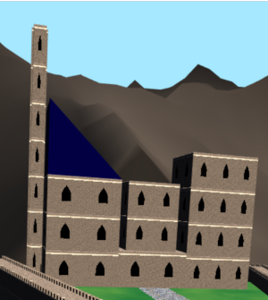
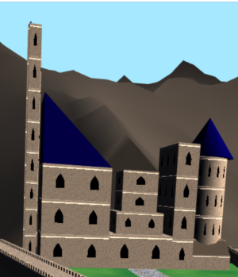

# Procedurally Generated Minus Tirith: CIS 566 Final Project
J. Reuben Wetherbee (wetherbe)

University of Pennsylvania - CIS 566 Spring 2019

## Objective
Use procedurally generated techniques to create a configurable version of the fortress of Minas Tirith from "The Lord of the Rings" by J. R. R. Tolkien.

## Demo
WebGL demo can be found at (https://jrweth.github.io/minas-tirith)

## Configurable levels
A feature of this project is that each level of the fortress can be configured separately from each other level.  This allows
 the user to have control over the general shape of the fortress and to be able to fine tune how they would want it to appear.
 
 As the levels are adjusted, the procedurally generated building shift to fit the generated roads and space in the new level footprint.  The following 
 attributes are available to edit for each level:
 - Wall Width
 - Wall Height
 - Level Width
 - Level Elevation Rise (from previous level)
 - Grid Width (number of possible slots for buildings along level wdith)
 - Building Footprint Target (general grid size that each buiding should occupy)

## Basic Terrain with FBM and distance fog

Background plain terrain color and mountain elevation was generated using a height map from [Fractal Brownian Motion](https://en.wikipedia.org/wiki/Fractional_Brownian_motion).
This height map was used to make two separate themes.  One is a more abstract theme which highlights the underlying geometry.  The other is a more 
natural color scheme.  

As the fortress levels are adjusted, the background mountians also had to be adjusted to fit with the adjustable fortress.

### Texture Theme

### Geometry Highlight Theme

## Fortress Ground Plane

Since the gates alternate from one side of the fotress to the other, the fortress ground plane was configured 
to automatically gradually rise to match the elevation change in the next level as the levels were changing.

## Radial road system

A randomized road system was created in order to create spacing between building groups.  It was also
necessary to take into consideration the gates at each level and the Mountain 
Spur. The highlighted road system is hidden by default but can be turned on 
using the user controls.

## Textured Level ground  and city walls

In order to gain experience using texture maps, two predefined textures were utilized to color the pavement of the city ground level 
and the city walls.

From [https://www.wildtextures.com](https://www.wildtextures.com)

From [http://www.texturise.club](http://www.texturise.club/2016/12/tileable-white-stone-texture.html)

## Mountain Spur with FBM

The spur jutting into the fortress was created using FBM in both the Vertex Shader to 
adjust the location of each point of a manipulated plane.  In the Fragment Shader, the
normal was determined by sampling nearby points, so that the light intensity could be
adjusted accordingly.

## Building location and footprint

The building locations and the footprint was expanded based upon a configurable setting for the target footprint for each level.  Buildings
are placed in the blocks defined by the roads.  The number of buildings placed is dependent
on the size of the block and the target footprint of the buildings.  The positions on the grid
of the block are chosen randomly and the the buildings are expand based upon open adjancent 
spaces to reach the target footprint. 

## Building shape grammar

The buildings were generated using a subtractive shape grammar.
The base footprint and height were first established.  The for 
every iteration through the shape grammar, each shape was replaced by
one or more shapes that fit within the parents footpring. 
The process continues until each shape has acheived
a "ternminal" state where no more shape replacements can occur.

Each building "shape" is constructed from simple deformed cubes and rendered using instanced
an instance renderer.  So all generated buildings at their most basic are made
from different collections of distortions of the unit cube.

## Palace and Tower Seed

On the seventh level of the fortress a palace and tower were created by using the shape
grammar.  The seed which determines which replacements can be adjusted in the 
user controls.  The following shows how the shape grammar takes the footprint and height
defined for the palace and tower to procedurally create the final building:

## Texturing Buildings

### Base Geometry

### Adding Adjustable Floors/Sections with Windows
The first step of adding texturing details was create a sense of floors.
Each resulting geometry block was divided into floors and sections
based upon it's height and footprint.  A window was then placed
via the fragment shader in the middle of each of these sections. Therefore,
when the buildings scale, the windows are appropriately placed evenly 
throughout the building.  Also, as the buildings increase in size, new floors
are automatically generated 

### Floor dividing ledges

Again in the fragment shader, the normal was manipulated at the 
divisions between each floor to give a further sense of their being separate floors.

### FBM Texture
Finally to give the building a more plaster feel, the surface of the buildings
were decorated with FBM to give them a plaster look.

## Lighting

The scene was lit by three light sources:
- Sun:  main light source
- Indirect Lighting: coming from direction opposite of sun simulating light reflected off objects
- Sky Lighting: blue shaded light coming from directly overhead

## For Further Enhancements

The current project could be further enhanced (given more time) by the following:
- more work on background plane and mountain geometry and shading
- use normal map for city walls and pavement textures
- shadow mapping for buildings, walls and spur etc.
- many more shapes in shape grammar

