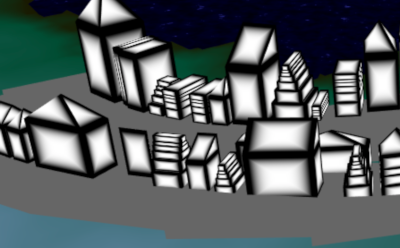

# CIS 566 Homework 6: City Generation
J. Reuben Wetherbee (wetherbe)
## Objective
- Use procedurally generated techniques to create a configurable version of the fortress of Minas Tirith

## Demo
WebGL demo can be found at (https://jrweth.github.io/minas-tirith)

## Configurable levels
Each level can be configured separately from each other level for attributes such as width / wall width / elevation rise / building grid width etc

- most recent push has some errors here that are still being worked on 

## Basic Terrain with FBM 

Ground plane terrain was taken from previous assignment and uses a height map using [Factianal Brownian Motion](https://en.wikipedia.org/wiki/Fractional_Brownian_motion).
- Water: Any heights below 0.4 were designated as water.
- Coast: Height between 0.4 and 0.43
- Land: Heights above 0.43

- still have bit of work to do here -  probably wiil get rid of water unless I make a river

## Fortress Ground Plane

Since the gates alternate from one side of the fotress to the other, the fortress ground plane was configured 
to automatically gradually rise to match the elevation change in the next level as the levels were changing.

## Radial road system

A randomized road system was created in order to create spacing between building groups.

## Building location and footpring

The building locations and the footprint was expanded based upon a configurable setting for the target footprint for each level.  Buildings
are placed in the blocks defined by the roads and then expanded to reach the target footprint. 

## Building shape grammar
Buildings are constructed from various deformations of the cube according to a shape grammar where each shape in 
the grammar has a number of shapes which upon each iteration can replace them.  

## Still coming

- a bunch of texturing work
- quite a few more shape grammar elements for replacement
- some more decoration of buildings (windows/arches/doors etc)
- mountain geometry surrounding fortess
- advanced lighting
- mountain spur extending through fortress dividing each level in half with tunnels at each level

